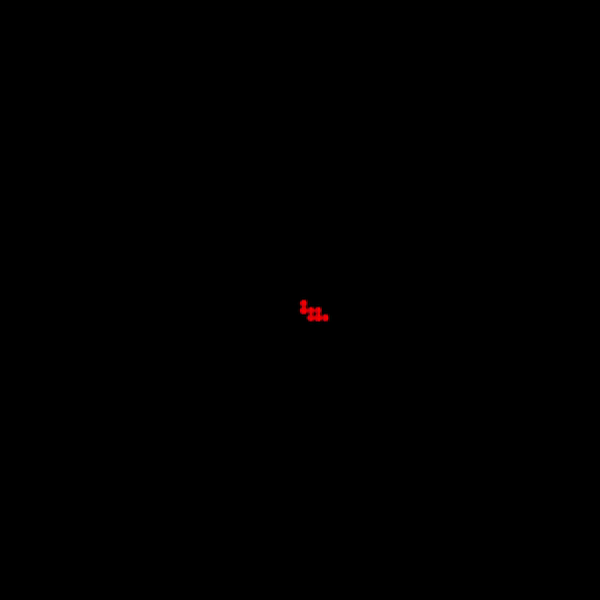
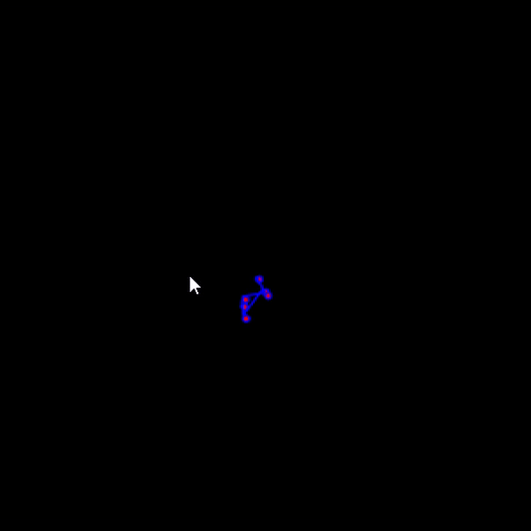
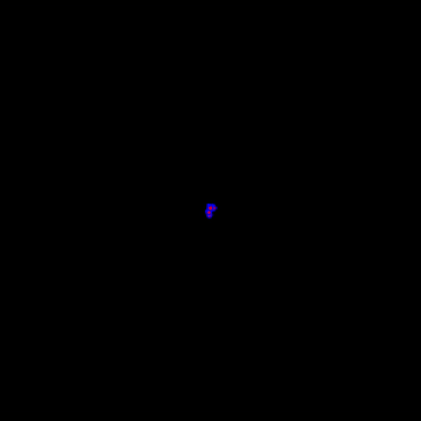

# QtRandomWalker

Stage 1: Walker based on randomly selecting up/down/left/right direction

Stage 2: Walker based on creating direction vector b/w -1 to 1 and drawing lines to stitch the path

Stage 3: Walker based on **Levy's flight** which jumps off to some other region after hovering in the same region for some time.

